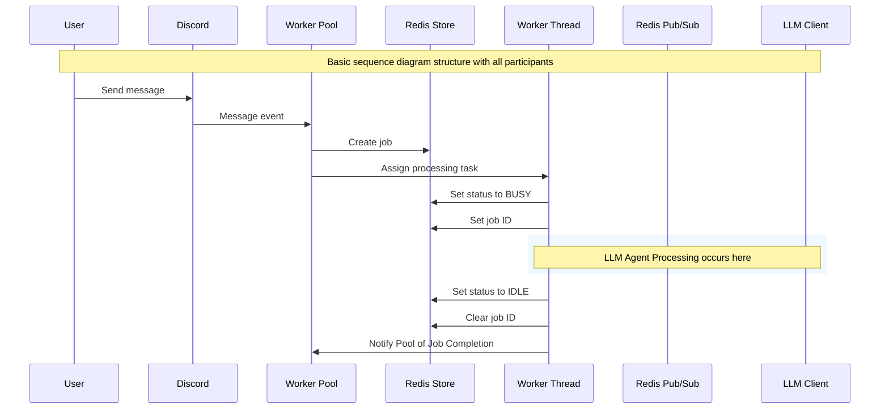

# Discord Message Processing Flow

This document outlines how Discord messages are processed through the Worker Pool architecture in the discord-agent-js application.

## Architecture Overview

The application uses an asynchronous worker pool architecture to handle Discord messages and LLM processing. This design prevents LLM calls from blocking the main Discord bot thread, ensuring responsive message handling.

### Key Components

- **Discord Bot**: Receives messages and publishes responses
- **Worker Pool**: Manages worker threads and job assignment
- **Redis Store**: Stores jobs and worker state
- **Worker Threads**: Process jobs with LLM clients
- **Redis Pub/Sub**: Communication channel for responses

## Message Processing Flow

### 1. Message Reception
When a user sends a message to Discord:
1. Discord bot receives `MessageCreate` event
2. Checks bot permissions (`ReadMessageHistory`, `SendMessages`) on the channel
3. Determines response type based on whether bot is mentioned:
   - **Mentioned**: `RESPONSE_TYPE.SEND_CHANNEL` (public response)
   - **Not mentioned**: `RESPONSE_TYPE.SEND_USER` (DM response)

### 2. Job Creation
The Discord bot creates a job with the following structure:
```typescript
{
  jobId: string,           // UUID
  engine: 'digitalocean',  // LLM engine to use
  priority: number,        // Job priority (default: 0)
  createdAt: number,       // Timestamp
  data: {
    action: 'chat',
    payload: {
      channelId: string,
      userId: string,
      messageId: string,
      response: RESPONSE_TYPE,
      messages: [
        { role: 'system', content: systemPrompt },
        { role: 'user', content: userMessage }
      ]
    }
  }
}
```

### 3. Job Storage & Assignment
1. Job stored in Redis with key: `job:{jobId}:{priority}:{timestamp}`
2. Worker Pool calls `assignAvailableWorkers()`
3. For each worker, checks status: `worker:{workerId}:status`
4. Assigns job to first available (IDLE) worker

### 4. Worker Processing
When a worker receives a job:
1. Updates status to `BUSY` in Redis
2. Sets current job: `worker:{workerId}:job = jobId`
3. Loads job data from Redis using pattern: `job:{jobId}*`
4. Processes job with appropriate LLM client
5. **Note**: Actual job processing is currently incomplete (marked as TODO)

### 5. Response Handling
Once processing is complete:
1. Worker publishes response to Redis channel `'discord'`
2. Worker notifies pool: `parentPort.postMessage({action: 'response:complete'})`
3. Worker updates status back to `IDLE`
4. Pool deletes completed job from Redis

### 6. Discord Response
Discord bot subscribes to Redis channel `'discord'` and handles response types:

#### Response Types
- **`send:channel`**: Send message to specific channel
  ```typescript
  { type: 'send:channel', channelId: string, message: string }
  ```

- **`send:user`**: Send direct message to user
  ```typescript
  { type: 'send:user', userId: string, message: string }
  ```

- **`reply:message`**: Reply to specific message
  ```typescript
  { type: 'reply:message', channelId: string, messageId: string, message: string }
  ```

- **`send:typing`**: Show typing indicator
  ```typescript
  { type: 'send:typing', channelId: string }
  ```

## Redis Data Structure

### Job Storage
```
Key: job:{jobId}:{priority}:{timestamp}
Value: JSON serialized Job object
```

### Worker State
```
Key: worker:{workerId}:status
Value: STATE enum (0=INITIALIZING, 1=IDLE, 2=BUSY, 3=TERMINATING)

Key: worker:{workerId}:job
Value: Current job ID (empty string if idle)
```

### Pub/Sub Channel
```
Channel: 'discord'
Message: JSON serialized DiscordEvents
```

## Configuration

### Worker Pool Configuration
```json
{
  "workers": {
    "min": 1,
    "max": 10
  }
}
```

### LLM Client Configuration
```json
{
  "llmClients": {
    "digitalocean": {
      "engine": "digitalocean",
      "baseUrl": "https://api.digitalocean.com/v2/ai",
      "auth": "Bearer TOKEN"
    },
    "ollama": {
      "engine": "ollama",
      "baseUrl": "http://localhost:11434"
    }
  }
}
```

### Discord Configuration
```json
{
  "discord": {
    "token": "DISCORD_BOT_TOKEN",
    "llmClient": "digitalocean"
  }
}
```

## Fault Tolerance

### Worker Recovery
- Workers check their status on startup
- If status is `BUSY`, worker attempts to resume the job
- If no job ID found, worker resets to `IDLE`

### Job Persistence
- Jobs are stored in Redis and survive application restarts
- Worker state is tracked in Redis for recovery

## Current Implementation Status

### ✅ Implemented
- Discord message reception and event handling
- Job creation and Redis storage
- Worker pool management and job assignment
- Worker thread lifecycle management
- Redis pub/sub infrastructure
- Response type handling in Discord bot

### 🚧 In Progress / TODO
- **Worker job processing logic** (marked as TODO in `src/agents/worker/index.ts`)
- LLM client integration within workers
- Error handling and retry logic
- Job timeout handling
- Metrics and monitoring

## Sequence Diagram



## Related Files

- `src/discord/message.events.ts` - Discord message event handlers
- `src/agents/pool.ts` - Worker pool implementation
- `src/agents/worker/index.ts` - Worker thread implementation
- `src/discord/index.ts` - Discord bot setup and Redis pub/sub
- `src/redis.ts` - Redis client configuration
- `src/agents/types/worker.ts` - Type definitions
- `src/discord/interfaces.ts` - Discord event types
